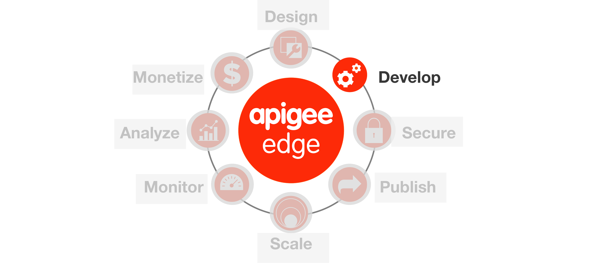
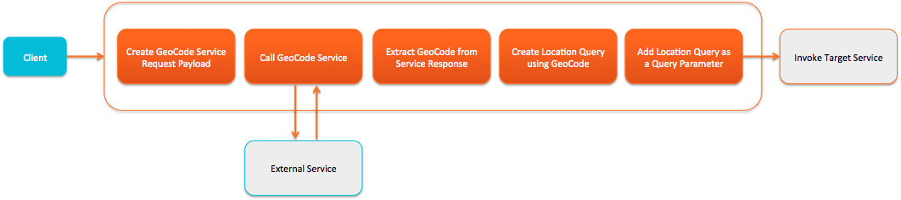
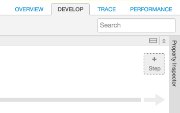
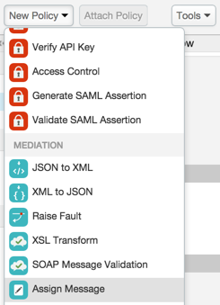
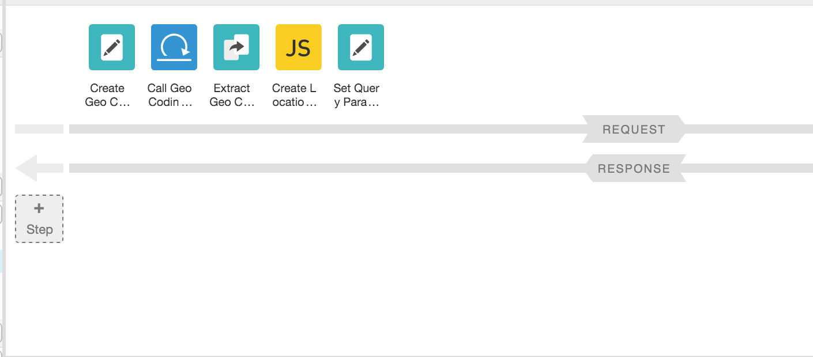

*Appendix 1 - Creating Composite APIs*



**Overview**

Apigee Edge enables you to 'program' API behavior by using out of the
box 'policies'. A policy is like a module that implements a specific,
limited management function. Policies are designed to let you add common
types of management capabilities to an API easily and reliably. Policies
provide features like security, rate-limiting, transformation, and
mediation capabilities, saving you from having to code and maintain this
functionality on your own.

**Policy types**
Technically, a policy is an XML-formatted configuration file. Each
policy type's structure (for example, the required and optional
configuration elements) is defined by an XML schema.

Edge Policy types are grouped into the following functional
categories:

***Traffic management***
Policies in the traffic management category enable you to control the
flow of request and response messages through an API proxy. These
policies support both operational- and business-level control. They
give you control over raw throughput, and can also control traffic on
a per-app basis. Traffic management policy types enable you to enforce
quotas, and they also help you to mitigate denial of service attacks.

***Mediation***
Policies in the mediation category enable you to actively manipulate
messages as they flow through API proxies. They enable you to
transform message formats, from XML to JSON (and vice-versa), or to
transform one XML format to another XML format. They also enable you
to parse messages, to generate new messages and to change values on
outbound messages. Mediation policies also interact with basic
services exposed by API Services, enabling you to retrieve data about
apps, developers, security tokens, and API products at runtime.

***Security***
Policies in the security category support authentication,
authorization, as well as content-based security.

***Extension***
Policies in the extension category enable you to tap into the
extensibility of API Services to implement custom behavior in the
programming language of your choice.

Each Policy type is documented in detail in the [Policy reference
overview](http://apigee.com/docs/api-services/reference/reference-overview-policy).
This topic demonstrates general interaction, showing you how to create
Policies, and how to attach them to Flows in an API proxy
configuration.

**Objectives**

The goal of this lesson is to get you familiar with how to use the
Management UI to design and configure different types of policies to the
API Proxy that we created in the previous lab. We will primarily work
with mediation and extensibility policies in this lesson.

By the end of this lesson, you will have enhanced your proxy to accept a
‘zipcode’ and a ‘radius’ (in meters) query parameter, use those
parameters to return a list of payments that match the criteria, and
format the results to filter out some metadata from the BaaS result.

**Note**: Now that you are familiar with the Apigee Edge Management UI
navigation, the instructions will become terse and will be provided
without screenshots unless a new concept is being introduced.

**Prerequisites**

-   Lab 1 is completed

**Estimated Time : 30 mins**

1)  **Adding Policies to a Proxy** is done from the ‘Develop’ tab of the
    API Proxy.

    a.  Now that you have an API Proxy configured with a couple of
        resources, you will add logic to the ‘Get all payments’
        resource using policies.

The goal is to have the proxy perform a geolocation query against our
‘payments’ BaaS data collection to return results within a certain
radius of a zipcode (zipcode and radius both being query parameters
provided when calling the ‘/v1/{your\_initials}\_payment’ API).

API BaaS supports the ability to retrieve entities within a specified
distance of any geocoordinate based on its location property:

```
location within {distance_in_meters} of {latitude},{longitude}
```

As you can see, you need to provide the latitude and longitude
information to perform the query.

For mobile applications meant for smartphones, obtaining geocode
information is easy and can be provided directly as part of an API
call. For this lesson, assume that this API interface is being created
for devices and applications that cannot easily provide the
geocoordinate information, but simply requests the user to provide the
zipcode. In such a situation, the first thing is to obtain the
geo-coordinates for the zipcode provided before doing further
processing. Below are the high level steps to implement this in the
proxy:

-   Retrieve the zipcode and radius from the request query parameters
-   Use the zipcode as an input parameter to call an external service
    that converts the zipcode to the geo-coordinates
-   Extract the latitude and longitude geo-coordinates information from
    the response of the external service call
-   Use the geo-coordinates to create the geo-location query
-   Add the location query as a query parameter before the target BaaS
    service is invoked

A pictorial representation of the logic is depicted below:



For the service callout to convert the zipcode to the geocoordinate,
you will use the [*Google GeoCoding
API*](https://developers.google.com/maps/documentation/geocoding/)
([*https://developers.google.com/maps/documentation/geocoding/*](https://developers.google.com/maps/documentation/geocoding/)).

Now let’s implement the policies.

1)  Switch to the ‘Develop’ tab of the API Proxy

2)  From the ‘Navigator’ pane, select ‘Proxy Endpoints → Default → getPayments’


3)  **Use an Assign Message Policy** to prepare the service callout
    request

    a. Click on “+ Step” on the Request Flow

> 

    b. Select the ‘Assign Message’ policy with the following properties:

> 

-  Policy Display Name: **Create Geo Coding Request**
-  Policy Name: **Create-Geo-Coding-Request**

    c. Click on the ‘Create Geo Coding Request’ policy in the pipeline and
      modify the XML configuration in the ‘Code:
      Create-Geo-Coding-Request’ section, which appears underneath the
      Map as follows:

  ```
  <?xml version="1.0" encoding="UTF-8" standalone="yes"?>
  <AssignMessage async="false" continueOnError="false" enabled="true" name="Create-Geo-Coding-Request">
  <DisplayName>Create Geo Coding Request</DisplayName>
  <AssignTo createNew="true" type="request">GeoCodingRequest</AssignTo>
  <Set>
  <QueryParams>
  <QueryParam name="address">{request.queryparam.zipcode}</QueryParam>
  <QueryParam name="region">US</QueryParam>
  <QueryParam name="sensor">false</QueryParam>
  </QueryParams>
  <Verb>GET</Verb>
  </Set>
  <!-- Set variables for use in the flow -->
  <AssignVariable>
  <Name>zipcode</Name>
  <Ref>request.queryparam.zipcode</Ref>
  </AssignVariable>
  <AssignVariable>
  <Name>radius</Name>
  <Value>0</Value>
  <Ref>request.queryparam.radius</Ref>
  </AssignVariable>
  </AssignMessage>
  ```

*(You can find the policy xml*
[**here**](https://gist.github.com/prithpal/f3222b3f220c6fa18e13)*.
Click the “Raw” button and copy/paste into your policy editor).*

Here's a brief description of the elements in this policy. You can
read more about this policy in [Assign Message
policy](http://apigee.com/docs/api-services/reference/assign-message-policy).

**&lt;AssignMessage name&gt;** - Gives this policy a name. The name is
used when the policy is referenced in a flow.

**&lt;AssignTo&gt;** - Creates a named variable called
’GeoCodingRequest’of type ‘Request’. This variable encapsulates the
request object that will be sent by the ServiceCallout policy.

**&lt;Set&gt;&lt;QueryParams&gt;** - Sets the query parameters that
are needed for the service callout API call. In this case, the Google
Geocoding API needs to know the location, which is expressed with a
zipcode. The API calling client supplies this information, and we
simply extract it here. The region and sensor parameters are by the
API, and we just hardcode it to certain values here.

**&lt;Verb&gt;** - In this case, we are making a simple GET request to
the API.

**&lt;AssignVariable&gt;** - zipcode and radius are new variables
being created to store values being passed to the API. In this
example, the variables will be accessed later in the proxy flow.

**Note**: The properties associated with the ‘Assign Message’ policy
could have been modified using the ‘Property Inspector’ panel that’s
presented in the ‘Develop’ tab on the right. Any changes made in the
‘Code’ panel are reflected in the ‘Property Inspector’ panel and
vice-versa. We will use the ‘Property Inspector’ panel to set
properties for some of the policies as the lesson progresses.

4)  **Use the Service Callout Policy to invoke the Google GeoCoding API**

    a.  From the ‘New Policy’ drop-down, select the ‘Service Callout’
        policy and add it with the following properties:

        -   Policy Display Name: Call Geo Coding API
        -   Policy Name: Call-Geo-Coding-API

    b.  For the ‘Call Geo Coding API’ policy, change the values of the
        following properties in the ‘Property Inspector’:

        -   Request variable: GeoCodingRequest
        -   Response: GeoCodingResponse
        -   URL: http://maps.googleapis.com/maps/api/geocode/json

  ```
  <?xml version="1.0" encoding="UTF-8" standalone="yes"?>
  <ServiceCallout async="false" continueOnError="false" enabled="true" name="Call-Geo-Coding-API">
  <DisplayName>Call Geo Coding API</DisplayName>
  <Properties/>
  <Request clearPayload="true" variable="GeoCodingRequest">
  <IgnoreUnresolvedVariables>false</IgnoreUnresolvedVariables>
  </Request>
  <Response>GeoCodingResponse</Response>
  <HTTPTargetConnection>
  <Properties/>
  <URL>http://maps.googleapis.com/maps/api/geocode/json</URL>
  </HTTPTargetConnection>
  </ServiceCallout>
  ```

Here's a brief description of the elements that were modified in this
policy. You can read more about this policy in [Service Callout
policy](http://apigee.com/docs/api-services/reference/service-callout-policy).

**&lt;Request variable&gt;** - This is the variable ‘GeoCodingRequest’
that was created in the AssignMessage policy in the previous step. It
encapsulates the request going to the Google Geocoding API.

**&lt;Response&gt;** - This element names a variable
‘GeoCodingResponse’ in which the response from the Google Geocoding
API will be stored. As you will see, this variable will be accessed
later by the ExtractVariables policy.

**&lt;HTTPTargetConnection&gt;&lt;URL&gt;** - Specifies the target URL
to be used by the service callout - in this case the URL of the Google
Geocoding API: ‘http://maps.googleapis.com/maps/api/geocode/json’

5)  **Use the Extract Message Policy to parse the service callout
    response**

    a.  From the ‘New Policy’ drop-down, select the ‘Extract Variables’
        > policy and add it with the following properties:

        -   Policy Display Name: Extract Geo Codes
        -   Policy Name: Extract-Geo-Codes

    b.  For the ‘Extract Geo Codes’ policy, change the XML configuration
        of the policy using the ‘Code: Extract Geo Codes’ panel as
        follows:

  ```
  <?xml version="1.0" encoding="UTF-8" standalone="yes"?>
  <ExtractVariables async="false" continueOnError="false" enabled="true" name="Extract-Geo-Codes">
  <DisplayName>Extract Geo Codes</DisplayName>
  <Source>GeoCodingResponse</Source>
  <VariablePrefix>geocodeResponse</VariablePrefix>
  <JSONPayload>
  <Variable name="latitude">
  <JSONPath>$.results[0].geometry.location.lat</JSONPath>
  </Variable>
  <Variable name="longitude">
  <JSONPath>$.results[0].geometry.location.lng</JSONPath>
  </Variable>
  </JSONPayload>
  </ExtractVariables>
  ```

*(You can find the policy xml*
[**here**](https://gist.github.com/prithpal/d97146f2c30160992256)*.
Click the “Raw” button and copy/paste into your policy editor).*

Here's a brief description of the elements that were modified in this
policy. You can read more about this policy in [Extract Variables
policy](http://apigee.com/docs/api-services/reference/extract-variables-policy).

**<Source>** - Specifies the response variable
‘GeoCodingResponse’ that we created in the ServiceCallout policy. This
is the variable from which this policy extracts data.

**<VariablePrefix>** - The variable prefix ‘geocodeResponse’
specifies a namespace for other variables created in this policy. The
prefix can be any name, except for the reserved names defined by the
[Apigee Edge Platform's predefined
variables](http://mktg-dev.apigee.com/docs/api-platform/api/variables-reference).

**<JSONPayload>** - This element retrieves the response data
that is of interest and puts it into named variables. In fact, the
Google Geocoding API returns much more information than latitude and
longitude. However, these are the only values needed for these
lessons. You can see a complete rendering of the JSON in the [Google
Geocoding API
documentation](https://developers.google.com/maps/documentation/geocoding/).
The values of geometry.location.lat and geometry.location.lng are
simply two of the many fields in the returned JSON object.

It may not be obvious, but it's important to see that ExtractVariables
produces two variables whose names consist of the variable prefix
(geocodeResponse) and the actual variable names that are specified in
the policy. These variables are stored in the API proxy and will be
available to other policies within the proxy flow, as you will see.
The variables are: geocodeResponse.latitude &
geocodeResponse.longitude

6)  **Use the Javascript Policy to create the Location Query to send
    to the BaaS target endpoint**

    a.  From the ‘New Policy’ drop-down, select the ‘Javascript’ policy
        and add it with the following properties:

        -   Policy Display Name: Create Location Query
        -   Policy Name: Create-Location-Query
        -   Script File: Create new script
        -   Script Name: Create-Location-Query.js

    b.  Once the policy has been added, from the ‘Navigator’ panel go to
        ‘Scripts → Javascript’ section and select the
        ‘Create-Location-Query.js’ script file

    c.  Add the following code to the ‘Create-Location-Query.js’ script
        in the ‘Code: Create Location Query’ panel:

  ```
  var latitude = context.getVariable("geocodeResponse.latitude"),
  longitude = context.getVariable("geocodeResponse.longitude"),
  radius = context.getVariable("radius");

  // set default (0 meters)
  radius = (radius == "") ? "0" : radius;

  // set BaaS query
  var baasQL = "location within " + radius + " of " + latitude + "," + longitude;
  context.setVariable("baasQL", baasQL);
  ```

*(You can find the javascript file content*
[**here**](https://gist.github.com/prithpal/680ca505dbacc267d1dd)*.
Click the “Raw” button and copy/paste into your policy editor).*

This Javascript code uses the ‘context’ object, which is part of the
[Apigee Edge Javascript object
model](http://apigee.com/docs/api-services/reference/javascript-object-model)
to retrieve 3 variables - geocodeResponse.latitude,
geoCodeResponse.latitude, radius - that were set by policies earlier
in the flow.

It sets a default in case the variables are empty strings, creates a
new query variable called ‘baasQL’ using the API BaaS query language
syntax for a location query, and adds the ‘baasQL’ variable to the
‘context’ object to be used later in the flow by the Assign Message
policy to set the query parameter before the API BaaS target endpoint
is invoked.

You can read more about this policy in [Javascript
policy](http://apigee.com/docs/api-services/reference/javascript-policy).

7)  **Use the Assign Message Policy to add the Location Query to the
    query parameter before BaaS target endpoint invocation**

    a.  From the ‘New Policy’ drop-down, select the ‘Assign Message’
        policy and add it with the following properties:

        -   Policy Display Name: Set Query Parameters
        -   Policy Name: Set-Query-Parameters

    b.  For the ‘Set Query Parameters’ policy, change the XML
        configuration of the policy using the ‘Code: Set Query
        Parameters’ panel as follows:

  ```
  <?xml version="1.0" encoding="UTF-8" standalone="yes"?>
  <AssignMessage async="false" continueOnError="false" enabled="true" name="Set-Query-Parameters">
  <DisplayName>Set Query Parameters</DisplayName>
  <Remove>
  <QueryParams>
  <QueryParam name="zipcode"/>
  <QueryParam name="radius"/>
  </QueryParams>
  </Remove>
  <Set>
  <QueryParams>
  <QueryParam name="ql">{baasQL}</QueryParam>
  </QueryParams>
  </Set>
  </AssignMessage>
  ```

*(You can find policy xml*
[**here**](https://gist.github.com/prithpal/a2057c62e9244db35e32)*.
Click the “Raw” button and copy/paste into your policy editor).*

Here's a brief description of the elements that were modified in this
policy. You can read more about this policy in [Extract Variables
policy](http://apigee.com/docs/api-services/reference/extract-variables-policy).

**<Remove><QueryParameters>** - Removes the query
parameters (‘zipcode’ and ‘radius’) that were sent in the original
client request to the API Proxy.

**<Set><QueryParameters>** - Adds a new query parameter
(‘ql’) with the variable ‘baasQL’ providing the actual value. Note
that the ‘baasQL’ variable was set by the previous Javascript policy
as part of the ‘context’ object.

8)  **Testing the API Proxy with the location query after deploying
    changes**

All the policies depicted in the diagram earlier in this lesson for
the request flow have been implemented. Your ‘Get Payments’ Proxy should
look as follows:

> 

Though you could have tested each policy iteratively as they were
being added to the flow, you have sufficient logic in the flow to test
the behavior of the flow to see if the results being returned from the
API BaaS are as expected.

    a.  Click on the ‘Save’ button to save and deploy the changes to the
        ‘{your_initials}_payment’ API Proxy

    b.  Wait for the ‘Successfully saved API Proxy’ message to appear and
        verify that your proxy is deployed to the ‘test’ environment

    c.  Go to the ‘Trace’ tab and start a trace session by clicking the
        ‘Start Trace Session’ button

    d.  Use Postman to test the ‘/GET payments’ request with the following
        query parameters combinations and review the results being
        returned
    -   zipcode=30004&radius=100

Note : Before invoking the API, change the URL to point your API i.e.
{your_initials}_payment.

Notice that the responses being returned by the API BaaS for the
various query parameter combinations are different as the
location-based query finds payments that match the criteria.

    f.  Switch back to the ‘Trace’ tab in the Apigee Edge Management UI.
        Review the executed policies and associated headers & variable
        data to better understand the flow

    g.  Note that when the proxy is called without any query parameters now,
        it returns an fault indicating that the ‘zipcode’ query parameter
        could not be resolved

<!-- -->

9)  **Modifying the response sent to the API client**

Many times the response coming from the backend target endpoint is not
exactly what you want to send to the calling client. The response may
need to be transformed, filtered, or augmented. For example, as you
review the response being returned from the API BaaS for this lesson,
you will notice that it has several metadata attributes (e.g.
‘application,’ ‘path,’ ‘organization,’ ‘applicationName,’ etc.) that
you may want to filter out prior to sending the response. You will use
a simple Javascript policy, similar to the one used before to create
the location query variable, to create a customized response.

    a.  Go to the ‘Develop’ tab of your proxy in the Apigee Edge
        Management UI, and add a new policy to the response of the Find All Payments flow.

    b.  From the ‘New Policy’ drop-down, select the ‘Javascript’ policy and
        add it with the following properties:
        -   Policy Display Name: Create Final Response
        -   Policy Name: Create-Final-Response
        -   Script File: Create new script
        -   Script Name: Create-Final-Response.js

    c.  Add the following code to the ‘Create-Final-Response.js’ script:

      
      var paymentsResponse = context.getVariable("response.content"),
      zipcode = context.getVariable("zipcode"),
      radius = context.getVariable("radius"),
      finalResponse = {};

      // initialize payments response
      finalResponse.payments = {};
      // add queryparams used as part of the payments response
      finalResponse.payments.queryparams = JSON.parse('{ ' + '"zipcode" : "' + zipcode + '", "radius" : "' + radius + '" }');

      // add the payments response
      if (paymentsResponse != null) {
      var paymentsJSON = JSON.parse(paymentsResponse);
      finalResponse.payments.resultsMetadata = {};

      // set results count
      finalResponse.payments.resultsMetadata.count = 0;
      if (paymentsJSON.count != null && paymentsJSON.count != "") {
      finalResponse.payments.resultsMetadata.count = paymentsJSON.count;
      }

      // set current results cursor
      if (paymentsJSON.params != null && paymentsJSON.params.cursor != null && paymentsJSON.params.cursor != "") {
      finalResponse.payments.resultsMetadata.currentCursor = paymentsJSON.params.cursor[0];
      }

      // set next results cursor
      if (paymentsJSON.cursor != null && paymentsJSON.cursor != "") {
      finalResponse.payments.resultsMetadata.nextCursor = paymentsJSON.cursor;
      }

      // set the list of payments
      finalResponse.payments.entities = paymentsJSON.entities;
      }

      // update the response that will be returned to the client
      context.setVariable("response.content", JSON.stringify(finalResponse));
    

    The above script creates a customized JSON response by merging
    information from the query parameters received in the original request
    and certain attributes from the API BaaS response. The final JSON
    format being created and returned is as follows:

      ```
      {
      “payments” : {
      “queryparams” : {
      “zipcode” : “zip code value”,
      “radius” : “radius value”
      },
      “resultsMetadata” : {
      “count” : count value,
      “currentCursor” : “current cursor value”,
      “nextCursor” : “next cursor value”
      }
      “entities” : \[Array of payment entities\]
      }
      }
      ```

    d.  Save the changes to the API Proxy, wait for it to successfully
        deploy and test again using Postman as described in Step 8 earlier
        in the lesson.

**Summary**

That completes the policy oriented approach to build composite APIs. You
learned how to use a variety of transformation and extensibility
policies to a proxy to create an API facade that has a more consumable
interface than the raw backend target endpoint interface. You also
learned how to call external services within the flow using the Service
Callout extensibility policy and to use the results to augment the
request to the target endpoint. You also learned how to quickly
incorporate Javascript code to transform and manipulate data before
sending it to the API consumer. Alternatively you can achieve this by
using programmability feature of Apigee Edge to implement this
functionality. We will see that in the next section.

Common themes and use cases, are best handled with standard
implementations and configuration. Apigee Edge provides Traffic
Management, Security, Mediation and other policies out of the box that
you can leverage, configure, and reuse across projects. These policies
provide common, consistent, scalable, tuned implementations of common
functionality. However complex problems are best handled via software
development, or a combination of configuration and development. Apigee
Edge enables you to solve these complex or unique needs through
extension policies. You can write these extension policies in
JavaScript, Java, node.js, or external services. In addition, with our
micro-services architecture, you can implement a set small, independent,
decoupled, focused processes with node.js and deploy them in the gateway
to meet your unique needs.
