*Appendix 2 - Securing APIs (OAuth)*

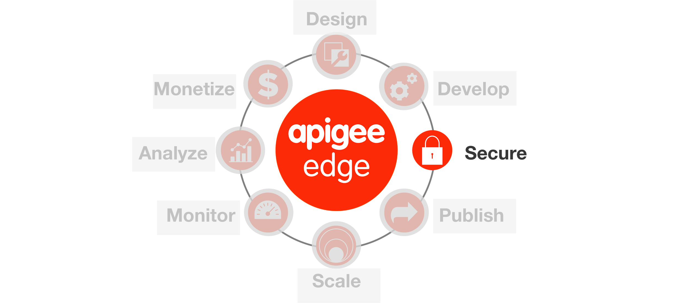

**Overview**

There are several out-of-the-box security policies that Apigee Edge
provides to protect your APIs. These security policies must be used
appropriately based upon your use cases. Apigee Edge supports:

***API Keys***

API key validation is the simplest form of app-based security that you
can configure for an API. Apps simply present an API key, and Apigee
Edge checks to see that the API key is in an approved state for the
resource being requested. For this reason the security associated with
API keys is limited. API keys can easily be extracted from app code
and used to access an API. You may find that API keys work better as
unique app identifiers than as security tokens. For more information,
see [API Keys](http://apigee.com/docs/api-services/content/api-keys).

***OAuth v2.0***

Here's the definition of OAuth from the OAuth 2.0 IETF specification.
"The OAuth 2.0 authorization framework enables a third-party
application to obtain limited access to an HTTP service, either on
behalf of a resource owner by orchestrating an approval interaction
between the resource owner and the HTTP service, or by allowing the
third-party application to obtain access on its own behalf."

All requests from the app for protected resources from the backend
service is negotiated using an access token. Access tokens are long
random strings generated by an authorization server after appropriate
app and/or user credentials are presented. Tokens are used to validate
requests for protected resources. If an app is compromised, the
resource server can revoke it's access token. In that case, the end
user does not need to change her username/password on the resource
server, her app simply needs to renegotiate for a new access token.

To go beyond app identification using API Keys, Apigee Edge provides
comprehensive support for OAuth v2.0. Apigee Edge includes an OAuth
2.0 authorization server implementation that lets you register apps
and secure API proxies with OAuth 2.0 using the four grant types that
are part of OAuth 2.0. For more information, see [OAuth 2.0
](http://apigee.com/docs/api-services/content/oauth-introduction)and
the [OAuth the Big
Picture](https://pages.apigee.com/oauth-big-picture-ebook.html) Apigee
eBook.

***OAuth v1.0a***

OAuth 1.0a defines a standard protocol that enables app users to
authorize apps to consume APIs on their behalf, without requiring app
users to disclose their passwords to the app in the process. Apigee
Edge enables you to protect APIs in a way that ensures that an app
uses has authorized the app to consume an API. Edge also provides
policy-based functionality for configuring the endpoints that app
developers can use to obtain access tokens. For more information, see
[OAuth
v1.0a](http://apigee.com/docs/api-services/reference/oauth-10-policy)
policy.

***SAML***

Apigee Edge enables you to authenticate and authorize apps that are
capable of presenting SAML tokens. A SAML token is a digitally signed
fragment of XML that presents a set of "assertions". These assertions
can be used to enforce authentication and authorization.

To use SAML terminology, Apigee Edge can function as a service
provider (SP) or an Identity Provider (IP). When Apigee Edge validates
SAML tokens on inbound requests from apps, it acts in the role of SP.
(API Services can also act in the IP role, when generating SAML tokens
to be used when communicating with backend services. For details on
SAML validation, see [SAML Assertion
policies](http://apigee.com/docs/api-services/reference/saml-assertion-policy).

**Content Based Security**

Message content is a significant attack vector used by malicious API
consumers. API Services provides a set of Policy types to mitigate the
potential for your backend services to be compromised by attackers or
by malformed request payloads.

***JSON threat protection***

JSON attacks attempt to use structures that overwhelm JSON parsers to
crash a service and induce application-level denial-of-service
attacks.

Such attacks can be mitigated using the JSONThreatProtection Policy
type.

See [JSON Threat Protection
policy](http://apigee.com/docs/api-services/reference/json-threat-protection-policy).

***XML threat protection***

XML attacks attempt to use structures that overwhelm XML parsers to
crash a service and induce application-level denial-of-service
attacks.

Such attacks can be mitigated using the XMLThreatProtection Policy
type.

See [XML Threat Protection
policy](http://apigee.com/docs/api-services/reference/xml-threat-protection-policy).

***General content protection***

Some content-based attacks use specific constructs in HTTP headers,
query parameters, or payload content to attempt to execute code. An
example is SQL-injection attacks. Such attacks can be mitigated using
the Regular Expression Protection Policy type.

See [Regular Expression Protection
policy](http://apigee.com/docs/api-services/reference/regular-expression-protection).

***Data Masking***

Apigee Edge enables developers to capture message content to enable
runtime debugging of APIs calls. In many cases, API traffic contains
sensitive data, such credit cards or personally identifiable health
information (PHI) that needs to filtered out of the captured message
content.

To meet this requirement, Edge defines 'mask configurations' that
enable you to specify data that will be filtered out of trace
sessions. Masking configurations can be set globally (at the
organization-level) or locally (at the API proxy level). Role-based
capabilities govern which users have access to the data that is
defined as sensitive.

For more information, see [Data
Masking](http://apigee.com/docs/api-services/content/data-masking)[
](http://apigee.com/docs/api-services/content/data-masking)[](http://apigee.com/docs/api-services/content/data-masking)

[](http://apigee.com/docs/api-services/content/data-masking)

**Objectives**

The objective of this lesson is to get you familiar with Apigee Edge
OAuth 2.0 Token Validation policies.

In the earlier lab, we saw how API Keys help in identifying the
consumer. Identifying an API consumer is beneficial from an analytics
and audit perspective, but in many situations, simply identifying the
API consumer is not secure enough. To add an additional level of
security, in this lesson you will replace the API Key Verification
policy with an OAuth 2.0 Token Validation policy using the
client-credentials two-legged OAuth flow.

**Prerequisites**

-   At a minimum, Lab 1 is completed.
-   A preliminary understanding of OAuth 2.0.
-   Apigee Oauth proxy deployed to your organization.

**Estimated Time: 60 mins**

**Publishing APIs**

To make it easier for Developers to consume APIs, Apigee Edge provides
the capability of publishing APIs. *Publishing* is the process of
making your APIs available to Developers for consumption. Publishing
APIs can be broadly defined by the following tasks:

-   Create the *API Products* on Apigee Edge that bundle your APIs.

-   Register *Developers* on Edge. Only a registered App Developer can
    register an App.

-   *Developers* register *Developer Apps* on Edge to access
    API products. In response, the developer receives an API key. Now
    that the developer has an API key, they can make requests to
    your APIs.

For more, see [Publishing
Overview](http://apigee.com/docs/developer-services/content/publishing-overview).

The following table defines some of the terms used to register apps
and generate keys:

  **Term Definitions**
  -----------------
  **API product**   A bundle of API proxies combined with a service plan that sets limits on access to those APIs. API products are the central mechanism that Apigee Edge uses for authorization and access control to your APIs. For more, see [API Products](http://apigee.com/docs/developer-services/content/what-api-product)[](http://apigee.com/docs/developer-services/content/what-api-product)

  **Developer**     The API consumer. Developers write apps the make requests to your APIs. For more, see Developer

  **App**           A client-side app that a developer registers to access an API product. Registering the app with the API product generates the API key for accessing the APIs in that product.

  **API key**       A string with authorization information that a client-side app uses to access the resources exposed by the API product. The API key is generated when a registered app is associated with an API product.

With the above brief introduction to API Products, Developers and
Developer Apps, you will now create one of each to obtain a valid API
Key that can be used to call your proxy

**NOTE : If you have already created a Product as part of the Lab 3, you
can skip this step.**

1)  **Publishing an API Product**

    a. From the Apigee Edge Management UI, go to Publish → API Products

    b. Click on ‘+ Product’ button to add a new product

    c. In the ‘Product Details’ section of the new product screen,
    enter or select the following values for the various fields:

        -   Display Name: {Your_Initials} Financial Services Product
        -   Description: API Bundle for a basic Financial Services App.
        -   Environment: Test
        -   Access: Public
        -   Key Approval Type: Automatic
> 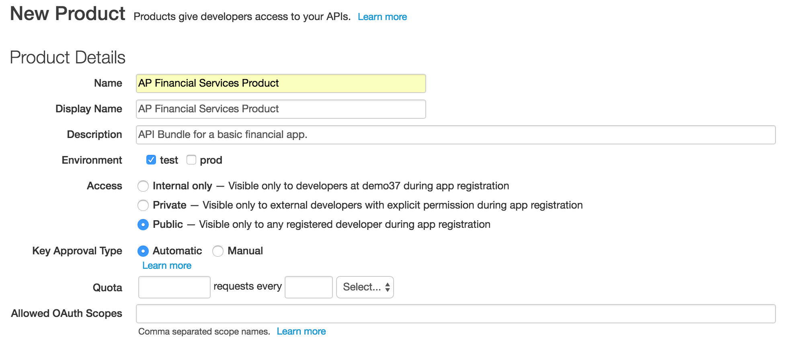

    d.  In the ‘Resources’ section select the following values for the
        various fields:
        -   API Proxy: {your_initials}_payments
        -   Revision: 1
        -   Resource Path: /

> 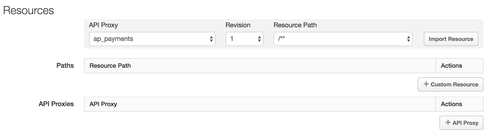

    e.  Click on ‘Import Resources’ to add the ‘/’ resource of your proxy to
        the API product

    f. Repeat the above two steps for the ‘/**’ resource

    g. Click ‘Save’ to save the API Product. The new product should now be
       listed on the ‘Products’ page.

**NOTE : If you have already registered a Developer account as part of the
lab-3, you can skip this step.**

2)  **Registering a Developer**

Developers access your APIs through apps. When the developer registers
an app, they receive a single API key that allows them to access all
of the API products associated with the app. However, developers must
be registered before they can register an app.

Developers typically have several ways of registering:

-   If you have a paid Edge account, through a Developer
    Services portal. See [Add and manage user
    accounts](http://apigee.com/docs/developer-services/content/add-and-manage-user-accounts)
    for more.

-   By accessing a form that uses the Edge management API to register
    the developer. See [Using the Edge management API to Publish
    APIs](http://apigee.com/docs/developers-services/content/using-edge-management-api-publish-apis)
    for more.

-   By a back-end administrator using the Edge management UI.

We covered how Developers can go through a
self-service registration process using the Developer Services Portal in
lab 3. For the continuity of this lesson, the following steps
describe the process of registering Developers and Developer Apps
using the Apigee Edge Management UI.

    a. From the Apigee Edge Management UI, go to Publish → Developers

    b. Click on ‘+ Developer’ button to add a new product

    c. Add a new developer with the following properties:
        -   First Name: Your First Name
        -   Last Name: Your Last Name
        -   Email: {your email_id}        
        -   Username: {firstname_lastname}

  > 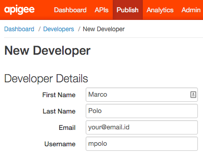

    d.  Click ‘Save’ to save the Developer. The new developer should now
    be listed on the ‘Developer’ page.

    NOTE : If you have already created a Developer App as part of the lab-3,
    you can skip this step.

3)  **Registering a Developer App**

Now that you have an API product and a developer, you can register a
Developer App with the API product. Registering the Developer App
generates the API key for the API products associated with the app.
You can then distribute the key to app developers so they can access
the features in the API products from the app.

We covered how to go about self-registering apps as a
developer using Developer Services Portal in Lab 3. For the
continuity of this lesson, the following steps describe the process of
registering Developer Apps using the Apigee Edge Management UI.

    a. From the Apigee Edge Management UI, go to Publish → Developer Apps

    b. Click on ‘+ Developer App’ button to add a new product

    c. In the ‘Developer App Details’ section, enter or select
    the following values for the various fields:

        -   Display Name: {Your_Initials} Financial Application
        -   Developer: {Your_name}
        -   Callback URL: Leave it blank

    d. In the ‘Products’ section, click on the ‘+ Product’ button

    e. From the ‘Product’ drop-down, select the product you created.

    f. Click the ‘check-mark’ button in the ‘Actions’ column to accept
    the changes

> 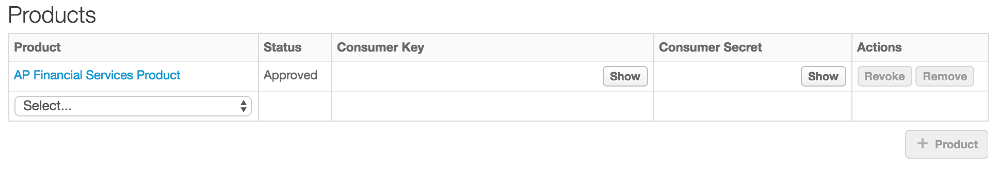

    g. Click ‘Save’ to save the Developer App. The new app should now be
    listed on the ‘Developer Apps’ page

    h. From the ‘Developer Apps’ page, select your App.

    i. In the ‘Products’ section, next to the entry for
    ‘{Your_Initials}_Financial Services Product,’ click ‘Show’ in
    the ‘Consumer Key’ and ‘Consumer Secret’ columns to display the generated keys

**Note:** Since you selected ‘Key Approval Type: Automatic’ when you
created the API product, the API key is automatically approved and you
can view it immediately

If you had selected ‘Approval Type: Manual,’ you would need to click
‘Approve’ in the ‘Actions’ column to approve the API key.

The way your proxy is configured, as of now, the Consumer Key (i.e.
the API Key) is the only key that the your App will need to access the
proxy resources. You will use the Consumer Secret (i.e. the API
Secret) in the next section when the security policy is changed from
API Key Verification to an OAuth Token Validation policy.

**Add security using OAuth 2.0: Client Credentials Grant**

For convenience, all organizations on Apigee Edge come preconfigured
with a set of OAuth 2.0 endpoints that implement the ‘client
credentials grant type’. For information about the configuration of
the default ‘oauth’ proxy, review [policies in the oauth token
endpoint](http://apigee.com/docs/api-services/tutorials/secure-calls-your-api-through-oauth-20-client-credentials).

This section of the lesson explains how to protect an API using this
default ‘oauth’ proxy configuration.

**About the client credentials grant type**

The client credentials grant type defines a procedure for issuing
access tokens in exchange for *App credentials*. These app credentials
are the consumer key and secret pair that Apigee Edge issues for each
app that is registered in an organization.

For this reason, it is relatively simple to 'step up' your API
security scheme from API key validation to OAuth client credentials.
Both schemes use the same consumer key and secret to validate the
client app. The difference is that client credentials provides an
extra layer of control, since you can easily revoke an access token
when needed, without requiring you to revoke the app's consumer key.
To work with the default OAuth endpoints, you can use any consumer key
and secret generated for app in your organization to retrieve access
tokens from the token endpoint. You can even enable client credentials
for apps that already have consumer keys and secrets.

Client credentials has very specific use cases, and is not the grant
type most commonly used for web and mobile apps. For a general
introduction to OAuth 2.0 grant types with definitions and use cases,
see [Introduction to OAuth
2.0](http://apigee.com/docs/api-services/content/oauth-introduction).

To support use cases with grant types other than client credentials,
the OAuth proxy must be configured with authorization endpoints. For
additional information, see [configuring authorization
endpoints](http://apigee.com/docs/api-services/content/oauth-endpoints)
and [authorizing requests using OAuth
2.0](http://apigee.com/docs/api-services/reference/authorize-requests-using-oauth-20).

4)  **Adding an OAuth 2.0 Token Validation Policy**

    a.  Go to the Apigee Edge Management UI browser tab

    b.  Since you will be adding an OAuth v2.0 policy, the API Key
    Verification policy is no longer necessary. Delete the ‘Verify API Key’
    policy from the ‘{your_initials}_payments’ proxy default proxy endpoint preflow.

> 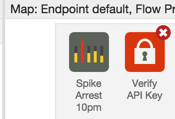

    c.  Using the “+Step” from the ‘Develop’ tab of the
    ‘{your_initials}_payments’ proxy, add the ‘OAuth v2.0’ policy with the following properties:

        -   Policy Display Name: Validate OAuth v2 Token
        -   Policy Name: Validate-OAuth-v2-Token

> 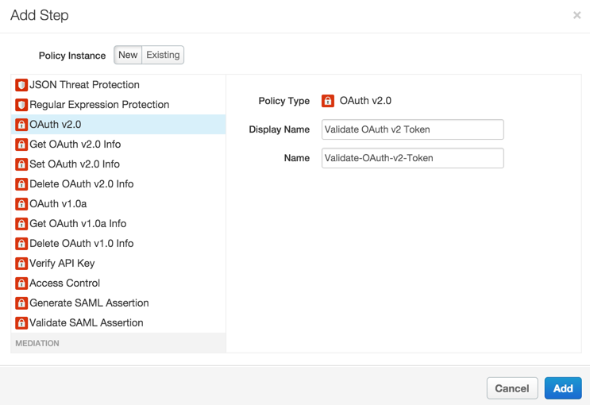

    d.  The ‘Validate OAuth v2 Token’ policy will get added after the
        ‘Response Cache’ policy. Drag and move the ‘Validate OAuth v2
        Token’ policy to be before the ‘Remove APIKey QP’ policy

> 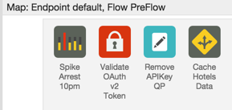

    e.  Review the XML configuration and/or the properties associated with
        the ‘Validate OAuth v2 Token’ policy.

  ```
  <?xml version="1.0" encoding="UTF-8" standalone="yes"?>
  <OAuthV2 async="false" continueOnError="false" enabled="true" name="Validate-OAuth-v2-Token">
  <DisplayName>Validate OAuth v2 Token</DisplayName>
  <FaultRules/>
  <Properties/>
  <Attributes/>
  <ExternalAuthorization>false</ExternalAuthorization>
  <Operation>VerifyAccessToken</Operation>
  <SupportedGrantTypes/>
  <GenerateResponse enabled="true"/>
  <Tokens/>
  </OAuthV2>
  ```

*(You can find the policy xml*
[**here**](https://gist.github.com/prithpal/45e6e50683b53685ebc6)*.
Click the “Raw” button and copy/paste into your policy editor).*

The value of the {Operation} element indicates the action to
take - in this case, verification of the access token.

The value of the {ExternalAuthorization} element is set to
‘false,’ indicating that Apigee Edge should validate the OAuth Token
rather than delegating it to an external validator.

    f.  Removing the Authorization Header After Validating the OAuth Token

        i.  Using “+ Step” from the “Develop” tab of the
            ‘{your_initials}_payments’ proxy, add the ‘Assign Message’
            policy with the following properties on the Proxy End point,
            Request flow :

            -   Policy Display Name: Remove Authorization Header
            -   Policy Name: Remove-Authorization-Header

> 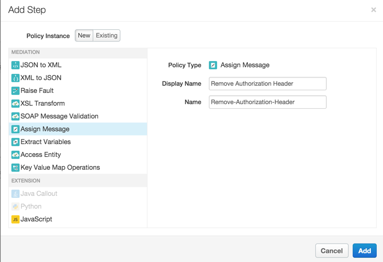

        ii.  The ‘Remove Authorization Header’ policy will get added after the
            ‘Response Cache’ policy. Drag and move the ‘Remove
            Authorization Header’ policy to be before the ‘Response Cache’
            policy

> 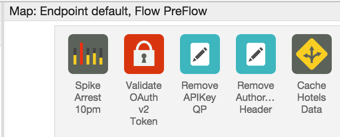

    g.  For the ‘Remove Authorization Header’ policy, change the XML
        configuration of the policy using the ‘Code: Remove Authorization
        Header’ panel as follows:

  ```
  <?xml version="1.0" encoding="UTF-8" standalone="yes"?>
  <AssignMessage async="false" continueOnError="false" enabled="true" name="Remove-Authorization-Header">
  <DisplayName>Remove Authorization Header</DisplayName>
  <Remove>
  <Headers>
  <Header name="Authorization"></Header>
  </Headers>
  </Remove>
  <IgnoreUnresolvedVariables>true</IgnoreUnresolvedVariables>
  <AssignTo createNew="false" transport="http" type="request"/>
  </AssignMessage>
  ```

*(You can find the policy xml*
[**here**](https://gist.github.com/prithpal/aaee5179e37a18a6d9ea)*.
Click the “Raw” button and copy/paste into your policy editor).*

As a security measure, the ‘Remove Authorization Header’ policy
removes the ‘Authorization’ header from the HTTP request message so it
is not sent to the backend service. In fact, if the ‘Authorization’
header is not removed, the Backend-as-a-Service API will throw an
invalid token error.

Note : You could also have this functionality as part of the “Remove
APIKey QP” policy.

5) **Testing the Oauth2.0 Token Validation Policy**

    a.  Testing the OAuth 2.0 Token Validation Policy without a Token

        i. Start a Trace session for the ‘{your_initials}_payments’ proxy

        ii. Send a test ‘/GET payments’ request from Postman

        Note : Replace ‘payment’ API proxy to point to {your_initials}_payment

        iii.  As expected, a fault will be returned since a valid OAuth
        Token has not been provided as part of the request:

  ```
  {
  fault: {
  faultstring: "Invalid access token",
  detail: {
  errorcode: "oauth.v2.InvalidAccessToken"
  }
  }
  }
  ```

        The above response shows that the OAuth2 Verification policy is being enforced as expected.

        iv.  Review the Trace for the proxy and the returned response to ensure
        that the flow is working as expected.

        v. Stop the Trace session for the ‘{your_initials}_payments’ proxy

    b.  Testing the OAuth 2.0 Token Validation Policy with a Valid Token

        i.  You will obtain a valid oauth token by directly calling the
            ’oauth’ API proxy token endpoint and passing the consumer key
            and consumer secret of the ‘{your_initials}_Financial
            App’ app.

        ii. Send a test ‘/POST OAuth Token - Client Cred’ request from
            Postman after setting appropriate values in the
            Authorization tab:
            -   client_id: {your_initials}_Financial App Consumer Key**
            -   client_secret: {your_initials}_Financial App Consumer
                Secret
            Query Parameters:
            -   grant_type: client_credentials (this should be added as
                query param)

> 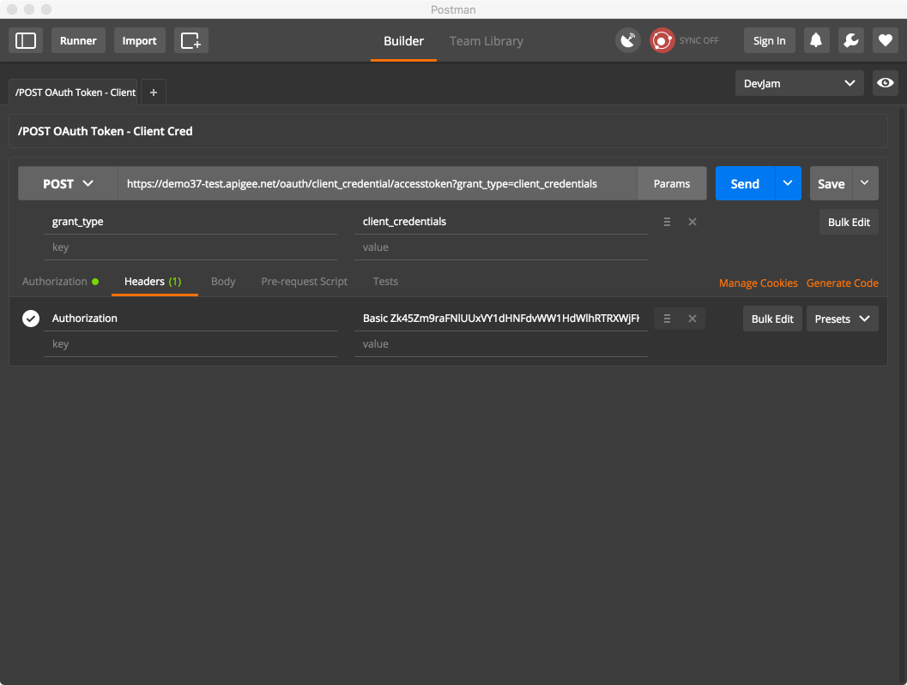

**Note**: Copy-paste the Consumer Key and Consumer Secret from the {your_initials}_Financial App’s detail page. As you copy-paste, remove any spaces before and after the values of the Consumer Key and Consumer Secret.

    c.  Review the response of the ‘/POST OAuth Token - Client
        Cred’ request. Copy the value of the ‘access_token’ attribute to
        use in the next step.

  ```
  {
  issued_at: "1414962637000",
  application_name: "ef723b8b-fdb1-4aae-9418-096d8ab7fec7",
  scope: "",
  status: "approved",
  api_product_list: "[Financial App]",
  expires_in: "3599",
  developer.email: "your@email.id",
  organization_id: "0",
  token_type: "BearerToken",
  client_id: "P24PNGrXN0gTNdVi6giT12Dq0vrG3ruB",
  access_token: "**j1AA2PeAtKOMCZa9tuCdDDsRqn8J**",
  organization_name: "demo37",
  refresh_token_expires_in: "0",
  refresh_count: "0"
  }
  ```

    d.  Start a Trace session for the ‘{your_initials}_payments’ proxy

    e. Set up the ‘/GET payments’ request in Postman with the following header:

        -   Header:
            -   Authorization: Bearer {access_token}

> 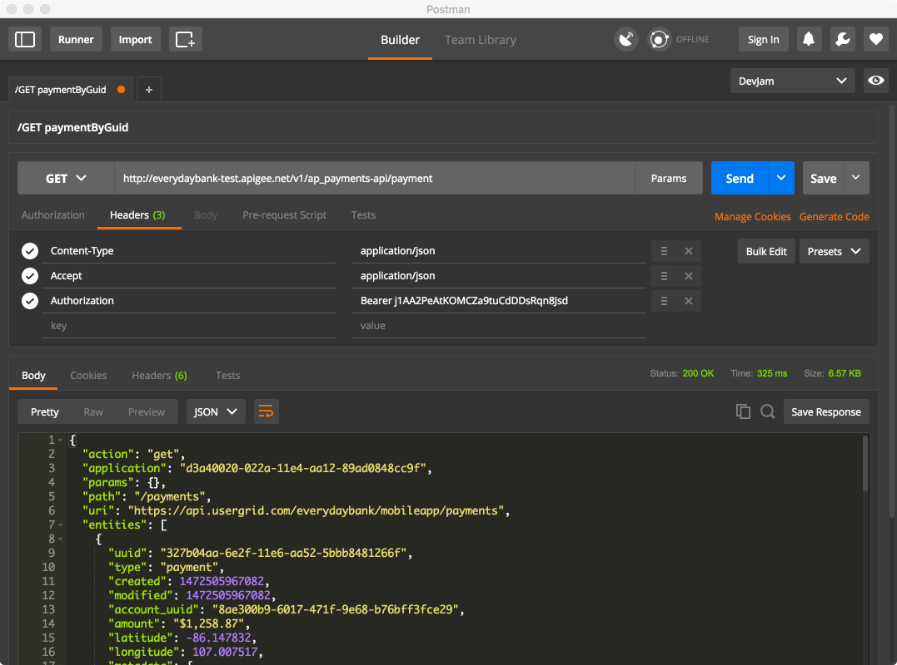

**Note**:

    -   Replace the API proxy URL with {your_initials}_payments URL.
    -   Replace the {access_token} with the value of the ‘access_token’ from the response in the step above.

    Send the Postman request, and review the Trace for the proxy and the returned
    response to ensure that the flow is working as expected.

**Summary**

That completes this hands-on lesson. In this lesson you learned about
the various out-of-the-box security related policies that are available
in Apigee Edge and to leverage a couple of those policies - API Key
Verification and OAuth 2.0 client credentials grant - to secure your
APIs.
