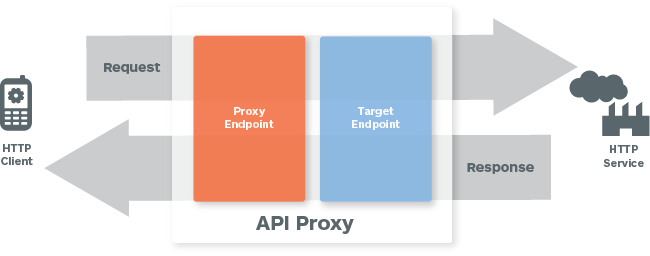
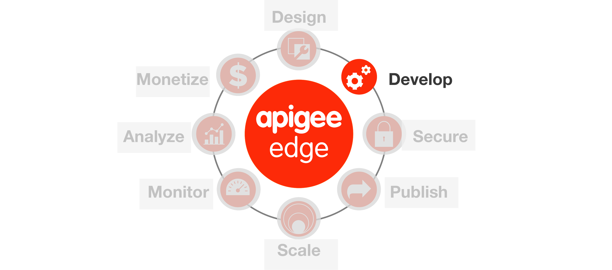

# Lab 1 – Design and Build a simple API Proxy

## Objectives

In this lab you will get familiar with the Apigee Edge Management UI by
creating a simple passthrough API Proxy to the GET API for the **payments** API. After creating the proxy you will also
learn how to deploy and undeploy a proxy. Finally you will also learn
how to use the Trace capabilities in the Management UI.

## Prerequisites

- Google's [Postman tool](https://www.getpostman.com/) installed on your workstation, or something equivalent to send REST API Requests.

## Introduction

An API is an interface between the provider of some backend system(s)
who wants to expose a set of services and the consumers of those
services who want to do something with them.

Many API providers describe their
APIs via informal mechanisms - for example a markdown document that shows typical requests and the responses. An alternative is to
formally specify a “contract” for the interface, which  describes all  of the requests and responses in an interface, in a standard, machine-readable format. This isn't a new idea; it's been used in interface description languages in many frameworks, ever since the first two programs were hooked together. Formal specification of an interface has its advantages: using the description, tools can generate server stubs, client libraries, testing harnesses.

There have been multiple proposed standards for describing APIs, but the most popular is called
[*OpenAPI Specification*](https://openapis.org/specification) . (The OpenAPI Specification was formerly known as
Swagger).

An API described via an OpenAPI spec document allows the API provider and
the API consumer to agree on how the API behaves. It makes for quicker development and fewer surprises.

Apigee is a key contributing member of and has partnered with a number
of other companies to help drive the OpenAPI spec and contribute open
source software to the community.

This is a partial list of the tools that Apigee has created,
open-sourced, or contributed to related to API-first design, OpenAPI
spec, or API deployment:

- [*apistudio.io*](http://apistudio.io/)
In-browser OpenAPI IDE including live documentation, code
generation, mocking, and cloud hosting.

- [*A127*](https://github.com/apigee-127/a127-documentation/wiki)
A toolkit for modeling and building rich, enterprise-class APIs in
Node.js on your laptop.

- [*swagger.io editor*](http://editor.swagger.io)
This web-based editor is the basis for the ones used in the above
two projects, but it also includes code generators for a number of
other languages.

- [apigee2openapi](https://github.com/anil614sagar/apigee2openapi)
A tool that generates an OpenAPI spec document from an existing API
Proxy defined in Apigee Edge.

## Part 1: A Brief Introduction to OpenAPI Spec

For the purposes of illustration, we've created a specification describing an API that manages information about payments.

**Estimated Time: 6 minutes**

1. Review the OpenAPI specification [document for the fictitious payments service]
(http://playground.apistudio.io/2d1a171d-0209-48fd-a8b7-a45bf80f334b/)
http://playground.apistudio.io/2d1a171d-0209-48fd-a8b7-a45bf80f334b/

2. On the right side of the editor, in the documentation view, scroll
down to bottom of the right panel until you find the **GET /payments** request.   Click the
**Try this operation** button:

3. Click on Send Request and observe the response

This shows you the basics of the online apistudio tool, and how it helps you to explore a specification document.

4. Examine the left-hand-side of the browser page.
This markup is called YAML - for Yet Another Markup Language. But it is possible to specify OpenAPI Spec documents using JSON as well. Explore the structure of the specification.  You don't have to learn it, but it is nice to understand what's possible.

## Part 2: About API proxies in Apigee Edge

**Estimated Time: 6 minutes (reading)**

Apigee Edge enables you to expose and manage APIs that can be easily
consumed by developers who build apps. You expose APIs on Apigee
Edge by building API proxies that act as proxies or facades for
backend services.

### The API Proxy Concept

Within the domain of Apigee Edge, an API Proxy is something that acts as a substitute
for the actual API implementation, sometimes called a "backend". Instead of clients directly connecting to a backend API, a client will connect to an API Proxy that runs in Apigee Edge, and Apigee Edge will connect to the backend API.

*Why Proxy?* The proxy obviously adds an extra layer, an extra network hop. Why do it? By adding this layer,

* ...you gain a level of control and insight into the inbound API requests. The proxy can verify security tokens, collect analytics information, serve requests from cache, perform traffic management, ... all without changing the backend API.

* ...you gain insight into the API usage.

* ...you decouple the developer-facing API from the API exposed by
backend services. This brings several advantages:

  * it shields "consumer developers" - those who are using the APIs - from changes in backend code or implementation.  As development teams make backend changes, consumer developers
continue to call the same API without any interruption.

  * it enables you, the API Provider, to innovate at the edge without impacting internal applications and
development teams. Edge acts as a *service virtualization* layer. For example For example, you could convert an XML-based API to a JSON-based API just by introducing a few rules in the proxy configuration, without changing any backend code. You could introduce new services that compose multiple backend services.

In short, the API Proxy metaphor enables *API Management*.

### Describing an API Proxy

In Apigee Edge, an API proxy is described by a set of configurations, usually specified in a bundle of XML configuration files.
These configuration files will stipulate what inbound requests the proxy listens for (all of them?  just those on url path /v1/service ?), whether to use TLS (we hope so) and if so, which ciphers to use, whether to use caching, how to verify API keys, and so on.  All of these basic things
can be done with simple configuration of Apigee Edge capabilities. No coding.

Apigee Edge also allows people to extend the capabilities with custom code. For example, if you would like to design an API Proxy that performs custom augmentation of the response received from the backend, you could do that by writing some JavaScript.

The configuration
and any custom code you provide (such as
JavaScript and Java), hosted in Apigee Edge, implements the facade for your backend HTTP
services.

### How an API Proxy works in Apigee Edge

API proxies in Apigee Edge manage request and response messages using a 'pipeline'
processing model.  A request arrives in Edge, and according to the configuration you provide, a series of steps operates on the inbound message. Check for a key. Enforce a Quota, transform a message, and so on.  You customize the behavior of your
API Proxy by attaching Policies (or logical processing steps) to request and response Flows.

In an API proxy configuration, there are two types of *endpoints*:

- **ProxyEndpoint**
This is the inbound endpoint. The configuration attached to the ProxyEndpoint manages requests arriving from apps
that consume your API. You configure the ProxyEndpoint to define
the base URL path of your API. You usually attach Policies to the
ProxyEndpoint to enforce security, quota checks, and other types
of access control and rate-limiting.

- **TargetEndpoint**
This is the outbound endpoint. The configuration for the TargetEndpoint manages interactions with
your backend services on behalf of consumer apps. You configure
the TargetEndpoint to forward request messages to the proper
backend service. You usually attach Policies to the TargetEndpoint
to ensure that response messages are properly formatted for the
app that made the initial request.

See the graphic below, showing a basic
request and response exchange between an app (HTTP client) and a backend
service is managed in an API proxy by a ProxyEndpoint and
TargetEndpoint.

You can interactively build API proxies using the Apigee Edge management UI. You can store proxy configurations offline (and in a code repository), and then import them
into Apigee Edge, using... *an API*. Apigee Edge itself exposes an API for management and administrative purposes.

For an overview of the Edge UI and API,
see [Using the Apigee Edge development
environment](http://apigee.com/docs/api-services/content/using-apigee-edge-development-environment).

## Note

Some API teams build APIs using Design-First approach: they start by
creating an OpenAPI
([f.k.a.](http://www.urbandictionary.com/define.php?term=FKA)
Swagger) document, experimenting with it in a designer tool, before
generating code.

Most teams typically have many existing back-end services and APIs
and they prefer a Build-First approach: They simply create the API
Proxy and its configuration, right within Apigee Edge. This lab
shows you the steps involved in this latter approach. We've already
got the OpenAPI specification document, so we won't be creating it.

## Part 3: Building your first API Proxy in Apigee Edge

**Estimated Time: 7 minutes**

Using that OpenAPI specification, let's create an API proxy in Apigee Edge.

Creating an API Proxy for a backend service that you want to expose
requires you to provide to Apigee Edge:

* the base network address for the backend service,
* the HTTP verbs and resource paths you would like to expose to "consumer developers", and
* a few other bits and bobs of information

Steps:

1. Open up a browser tab and log in to [*http://enterprise.apigee.com*](http://enterprise.apigee.com)

2. From the Organization drop-down in the top-right corner, select the organization assigned to you.

3. From the Environment drop-down, select **test**

4. From the main menu, select APIs → API Proxies

5. To create a new API proxy, select the + API Proxy button to add a new proxy.

6. On the New API Proxy form that is displayed, provide information needed to generate an API proxy. Select **Reverse Proxy** and click on **Use OpenAPI**

7. Paste in the URL for the OpenAPI Specification document:
http://playground.apistudio.io/2d1a171d-0209-48fd-a8b7-a45bf80f334b/spec

8. Click on ***apply*** and then click ***next***

9. Enter Proxy details
**Note**: In the following, replace **{your-initials}** with the initials of your name.
  * **Proxy Name**: **{your\_initials}\_payment**
  * **Project Base Path**: **/v1/{your\_initials}\_payment**
  * **Existing API**: **https://api.usergrid.com/{{org}}}/finance**

  *For this lab, please do not modify {{org}}. This value will be imported from the OpenAPI doc.

10. Verify that it looks mostly like this, except with **YOUR** initials:

11. click next.

12. Leave all of the **operations** selected from the OpenAPI spec to proxy. Click next.

13. Choose **Pass through (none)** for the authorization in order to choose not to apply any security policy for the proxy. We'll get to security in a later lab exercise. Click next.

14. Select only the **default** virtual host (http only) and Click next

15. Ensure that only the **test** environment is selected to deploy to and click **Build and Deploy**.

16. Once it has built and deployed click the link to view your proxy in the proxy editor. You should see something like this:

*Congratulations!* You have now built a pass-through API Proxy for an existing backend service.

This shows you the interactive experience, building a proxy using the Apigee Edge Administrative UI.

## Part 4: Test your proxy

**Estimated Time: 6 minutes**

At this point, we will start to use the **Postman** tool as a client
to invoke our proxy and continue to use **Postman** throughout the
rest of the labs.

1. Launch **Postman**. If you have never used Postman before, you can skip account creation process.

2. Create a new GET request and set the URL to the endpoint of the newly created API. (e.g. http://ORG-ENV.apigee.net/v1/INITIALS_payment/payment).

Optionally, you can import the [Postman collection](https://raw.githubusercontent.com/apickelsimer/DevJam-FS/master/Resources/devjam-postman.json) provided in the Resources directory of this repo. To import copy the Postman Collection JSON to your clipboard. Open Postman and click on the Import button on top left and select Paste Raw and then Import. Once imported, be sure to replace the URL the ORG, ENV, and INTIALS with your own.

3. Observe the lovely response!

4. For extra credit, you can try invoking the API proxy from other tools, like curl, or RESTclient, etc.

## Part 5: Deployment

**Estimated Time: 3 minutes**

In Apigee Edge, when you "deploy" an API Proxy, you make its
configuration active. Apigee Edge begins listening for inbound
requests on the base URL path you specified, and when such requests
arrive, any policy steps you've provided in the proxy configuration
will be executed. The proxy will then call the configured backend
system, and when the response arrives, it will run the configured
policies in the response flow.

> NB: In the proxy you've just created, there were no policies,
  which is why we called it a "pass-through proxy". But even so, it
  will act as a proxy - it will receive an inbound call, and then
  make an outbound call on behalf of the client.

Undeploying a proxy does the converse: it instructs Apigee Edge to
stop listening for inbound requests as configured in the proxy
definition. The "New API Proxy" wizard automatically deploys new
proxies, if you select an environment.

**Deploying or Undeploying a Proxy** to a given environment from the
Management UI is simple.

1. Back in the Edge UI, Click on the **Deployment** drop-down on the API Proxy page.

2. Notice that the proxy we just created is shown with a green dot  next to the **test** environment. This indicates that the proxy is deployed to test.

3. Click on the **test** environment name. Click "Undeploy" in the resulting confirmation box. This undeploys the proxy from the **test** environment. If you again select the Deploy dropdown, the green dot has become a grey dot.

4. Return to the Postman tool. Invoke the `GET /payment` request again.  You should now see that the request fails, "Unable to identify proxy for host".  This indicates that Apigee Edge is not listening for that in-bound request.

5. Return to the Edge UI.  Click on the **Deployment** drop-down again
and select the **test** environment. This again deploys the proxy to
the **test** environment.

6. Again, back to Postman. Invoke the `GET /payment` request again. The request works.

Things to consider:

* What's an environment? An environment is a runtime execution context for the API proxies in an organization. You must deploy an API proxy to an environment before it can be accessed. You can deploy an API proxy to a single environment or to multiple environments.

  An organization can contain multiple environments. For example, you might define a "dev", "test", and "prod" environment in an organization. For more on environments, see [the Apigee Edge documentation](http://docs.apigee.com/api-services/content/apigee-edge-organization-structure).

* It is possible to customize the error message that Apigee Edge returns when responding to an unknown request.  You can do this with a proxy that listens on the basepath of / .

## Part 6: Tracing

**Estimated Time: 6 minutes**

**Tracing the execution of a proxy** can also be done easily from the Management UI. This is a very powerful capability of Apigee Edge, since it makes it easy to troubleshoot and monitor API proxies. The Trace capability lets you probe the details of each step through an API proxy flow.

1. From the **{your\_initials}**\_payment API Proxy page, click on the **Trace** tab on the top right.

2. In that tab, select the correct environment from the **Deployment to Trace** drop-down. In your case there should only be one environment to choose - **Environment test, Revision 1**.

3. click Start Trace Session button.

4. In the request field, add '/payments' to the end of the URL, and send the request.

5. You will see the a transaction appear in the **Transactions** section and a visual representation of the executed proxy flow in the **Transaction Map** section.

6. The **Transaction Map** is interactive - click on the various execution steps within the flow and review the information provided in the **Phase Details** section. You will notice that for each step information such as headers, variables, payload, properties and other relevant information is available. This helps you quickly understand exactly what is happening within the proxy flow.

7. Of course you can send requests from other clients. Try the same request from Postman.  Then flip back to the Trace window to see the transaction.

8. Review the response returned by the proxy. It should be the same response as the one you observed when using the **Trace** tool in the Management UI. Switch to the **Trace** tab of the Apigee Edge Management UI and click on the **Stop Trace** button.

## Summary

That completes this hands-on lesson. Simple and quick. You learned the fundamentals of how to create an API Proxy, how to deploy and undeploy it to/from an environment, and how to trace the proxy flow. Throughout the rest of the hands-on labs you will be working with this Management UI to add policies to proxies, testing and tracing these proxies, and learning about the power of the Apigee Edge platform.
