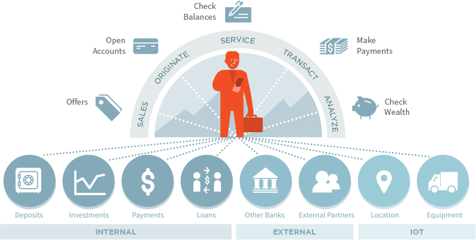

# Apigee DevJam - Financial Services

Find out how the world’s leading brands are using Apigee to power the world’s
leading APIs. Take advantage of this unique opportunity to start building
professional­grade APIs using Apigee Edge. This hands­on workshop will teach
you how to easily expose existing backend assets as secure, scalable APIs that
developers will actually want to use. You’ll get a chance to explore the next
generation of app development and see how Apigee’s Backend­as­a­Service
frees you from the bottlenecks of traditional IT operations. At the end of the
workshop, you’ll see how built­in mobile and social capabilities combine with the
power of Node.js to enable rapid development of modern apps.

**In this workshop, you will:**
* Build a high­ performance API out of an existing backend service using Apigee API Services
* Gain end­to­end visibility across your APIs from the user all the way to your backend using Apigee Analytics Services
* Understand how to quickly onboard developers and monetize your APIs using Apigee Developer Services

This is the supporting material for a one-day hands-on workshop that introduces developers to  Apigee Edge. We call it a "DevJam".

All of the material here is released under the [MIT license](LICENSE.md)

##Pre-Requisites: 

#####Apigee Account:
Navigate to https://enterprise.apigee.com/login. To create an account, you will need to request an account using the “Create Account” link. Once the account has been registered and your email address confirmed, you can proceed to login. If you have any issues with accessing the demo environment, please reach out to me.

#####Modern Browser (e.g. Chrome or Firefox):
If you do not already have a modern browser, such as Chrome or Firefox, please install this before the session. We do not recommend using Internet Explorer.

######REST Client Tool:
We recommend that you download and install Postman (an extension to Chrome or stand-alone installer) for testing of the APIs you build during the session. 
Postman can be downloaded from: https://www.getpostman.com/

##Agenda

#####Introduction to Apigee: 30 mins

####Labs

| Name                                                                                                                                                                                                                      | Duration  |
|-------------------------------------------------------------------------------------------------------------------------------|---------      |
| [Lab 1 – Design and Build a simple API Proxy](./Lab%20Guides/Lab%201%20-%20Design%20and%20Build%20a%20simple%20API%20Proxy)   | 30 mins       |
| [Lab 2 – Traffic Management for APIs](./Lab%20Guides/Lab%202%20-%20Traffic%20Management%20for%20APIs)                                     | 30 mins   |
| [Lab 3 – Publish APIs](./Lab%20Guides/Lab%203%20-%20Publish%20APIs)                                                                                   | 60 mins       |
| [Lab 4 - Creating Custom Reports](./Lab%20Guides/Lab%204%20-%20Creating%20Custom%20Reports)                                   | 45 mins       |
| [Lab 5 – Introduction to API BaaS](./Lab%20Guides/Lab%205%20-%20Introduction%20to%20API%20BaaS%20(Backend-as-a-Service))      | 30 mins       |

####Appendix

| Name                                                                                                                                                                                                                      | Duration  |
|-------------------------------------------------------------------------------------------------------------------------------|---------      |
| [Appendix 1 - Creating Composite APIs](./Appendix/Appendix%201%20-%20Creating%20Composite%20APIs)                             | 60 mins       |
| [Appendix 2 - Securing APIs (OAuth)](./Appendix/Appendix%202%20-%20Securing%20APIs%20(OAuth))                                             | 30 mins   |

#####NOTE: Appendix items are optional.

######NOTE: You may need to whitelist the following URLs if you have strict internet usage policies:
* \*apigee.com/\*
* \*apigee.net/\*
* \*apistudio.io/\*
* \*github.com/\*
* \*usergrid.com/\*
* \*maps.googleapis.com/\*
* \*s3.amazonaws.com/\*

